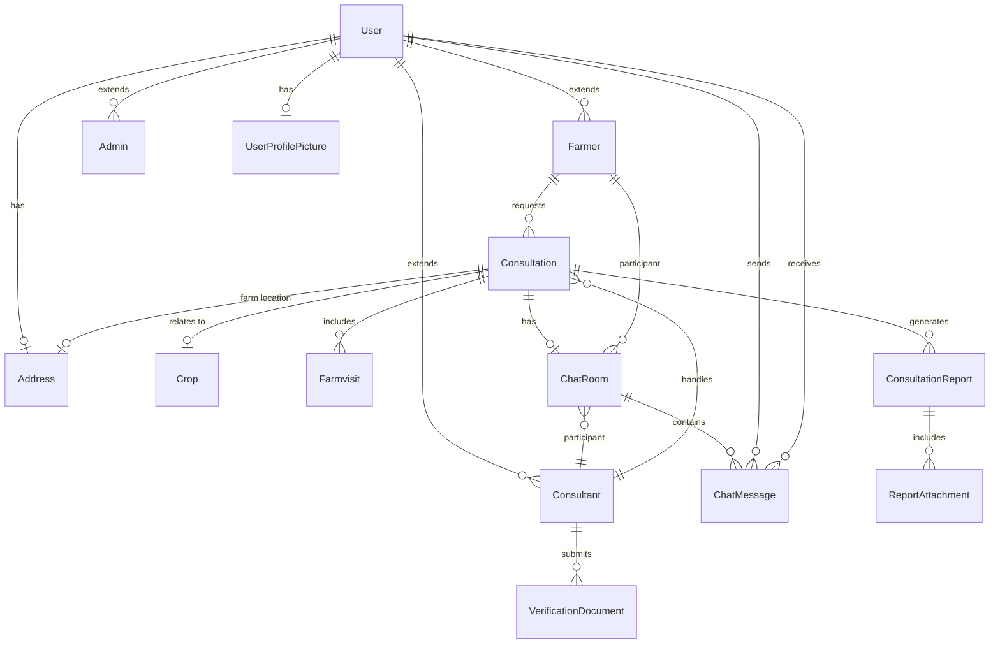

# E-Consultancy for Farmers - Project Documentation

## Table of Contents
1. [Project Overview](#project-overview)
2. [Architecture](#architecture)
3. [Technology Stack](#technology-stack)
4. [Database Schema](#database-schema)
5. [API Documentation](#api-documentation)
6. [Frontend Components](#frontend-components)
7. [Setup and Installation](#setup-and-installation)
8. [Features](#features)
9. [Security](#security)

---

## Project Overview

**E-Consultancy for Farmers** is a full-stack web application that connects farmers with agricultural consultants for expert advice on crop management, farming techniques, and agricultural issues. The platform facilitates consultation requests, farm visits, real-time chat communication, and comprehensive reporting.

### Purpose
- Enable farmers to request consultations from verified agricultural consultants
- Facilitate real-time communication between farmers and consultants
- Manage farm visit schedules and consultation reports
- Provide a secure, user-friendly platform for agricultural advisory services

### Key Stakeholders
- **Farmers**: Request consultations, communicate with consultants, manage their profiles
- **Consultants**: Accept consultation requests, schedule farm visits, provide expert advice
- **Admins**: Manage user verification, oversee platform operations

---

## Architecture

### System Architecture

The application follows a **client-server architecture** with clear separation of concerns:

```
┌─────────────────────────────────────────────────────────────┐
│                     Client Layer (Angular 20)                │
│  ┌──────────────┐  ┌──────────────┐  ┌──────────────┐      │
│  │   Components │  │   Services   │  │   Guards     │      │
│  │   - Farmer   │  │   - Auth     │  │   - Auth     │      │
│  │   - Consult. │  │   - Chat     │  │   - Role     │      │
│  │   - Chat     │  │   - API      │  │              │      │
│  └──────────────┘  └──────────────┘  └──────────────┘      │
└─────────────────────────────────────────────────────────────┘
                            ↕ HTTP/WebSocket
┌─────────────────────────────────────────────────────────────┐
│              Server Layer (Spring Boot 3.5.7)                │
│  ┌──────────────┐  ┌──────────────┐  ┌──────────────┐      │
│  │ Controllers  │  │   Services   │  │ Repositories │      │
│  │  - Auth      │  │   - Auth     │  │   - JPA      │      │
│  │  - Chat      │  │   - Chat     │  │   - Custom   │      │
│  │  - Consult.  │  │   - Email    │  │              │      │
│  └──────────────┘  └──────────────┘  └──────────────┘      │
│                                                               │
│  ┌──────────────┐  ┌──────────────┐                         │
│  │  Security    │  │  WebSocket   │                         │
│  │  - JWT       │  │  - STOMP     │                         │
│  │  - Spring    │  │  - SockJS    │                         │
│  └──────────────┘  └──────────────┘                         │
└─────────────────────────────────────────────────────────────┘
                            ↕
┌─────────────────────────────────────────────────────────────┐
│              Database Layer (MySQL 8)                        │
│  - Users (Farmers, Consultants, Admins)                     │
│  - Consultations                                             │
│  - Chat Rooms & Messages                                    │
│  - Farm Visits & Reports                                    │
└─────────────────────────────────────────────────────────────┘
```

### Design Patterns

1. **MVC Pattern**: Clear separation between Models (Entities), Views (Angular Components), and Controllers
2. **Repository Pattern**: Data access abstraction using Spring Data JPA
3. **Service Layer Pattern**: Business logic encapsulation in service classes
4. **DTO Pattern**: Data Transfer Objects for API communication
5. **Singleton Pattern**: Services and repositories managed by Spring IoC container
6. **Observer Pattern**: WebSocket for real-time chat updates

---

## Technology Stack

### Frontend (Client)

| Technology | Version | Purpose |
|------------|---------|---------|
| **Angular** | 20.3.15 | Core framework for SPA development |
| **TypeScript** | 5.9.2 | Type-safe JavaScript |
| **Tailwind CSS** | 4.1.17 | Utility-first CSS framework |
| **RxJS** | 7.8.0 | Reactive programming for async operations |
| **STOMP.js** | 7.2.1 | WebSocket protocol for real-time chat |
| **SockJS Client** | 1.6.1 | WebSocket fallback support |
| **AOS** | 2.3.4 | Scroll animations |
| **Spartan UI** | 0.0.1-alpha.572 | UI component library |
| **ng-icons** | 32.0.0+ | Icon library |

### Backend (Server)

| Technology | Version | Purpose |
|------------|---------|---------|
| **Spring Boot** | 3.5.7 | Application framework |
| **Java** | 21 | Programming language |
| **Spring Data JPA** | 3.5.7 | Database ORM |
| **Spring Security** | 6.x | Authentication & authorization |
| **Spring WebSocket** | 6.x | Real-time communication |
| **MySQL Connector** | Latest | Database driver |
| **Lombok** | Latest | Boilerplate code reduction |
| **JWT (jjwt)** | 0.13.0 | Token-based authentication |
| **Spring Mail** | 3.5.7 | Email functionality |
| **Jackson** | Latest | JSON serialization |

### Database

- **MySQL 8**: Relational database
- **Database Name**: `Efarming`

### Development Tools

- **Maven**: Backend dependency management
- **npm**: Frontend package management
- **Angular CLI**: Frontend development tooling

---

## Database Schema

### Entity Relationship Diagram



### Core Entities

#### 1. **User** (Base Entity)
- **Inheritance Strategy**: JOINED
- **Fields**:
  - `id` (Long, PK)
  - `firstName`, `lastName` (String)
  - `phone` (String, unique)
  - `email` (String, unique)
  - `password` (String, encrypted)
  - `role` (Enum: FARMER, CONSULTANT, ADMIN)
  - `isActive`, `isVerified` (Boolean)
  - `createdAt`, `updatedAt` (LocalDateTime)
- **Relationships**:
  - One-to-One: `Address`, `UserProfilePicture`

#### 2. **Farmer** (extends User)
- Inherits all User fields
- **Relationships**:
  - One-to-Many: `Consultation` (as requester)
  - One-to-Many: `ChatRoom`

#### 3. **Consultant** (extends User)
- Inherits all User fields
- **Relationships**:
  - One-to-Many: `Consultation` (as handler)
  - One-to-Many: `ChatRoom`
  - One-to-Many: `VerificationDocument`

#### 4. **Consultation**
- **Fields**:
  - `id` (Long, PK)
  - `topic`, `description` (String)
  - `consultationRequestStatus` (Enum: PENDING, APPROVED, REJECTED, COMPLETED, CANCELLED)
  - `createdAt`, `updatedAt`, `closedAt` (LocalDateTime)
- **Relationships**:
  - Many-to-One: `Farmer`, `Consultant`, `Crop`
  - One-to-One: `Address` (farm location)
  - One-to-Many: `Farmvisit`, `ConsultationReport`
  - One-to-One: `ChatRoom`

#### 5. **ChatRoom**
- **Fields**:
  - `id` (Long, PK)
  - `createdAt`, `updatedAt`, `lastMessageAt` (LocalDateTime)
  - `isActive` (Boolean)
- **Relationships**:
  - Many-to-One: `Farmer`, `Consultant`
  - One-to-One: `Consultation`
  - One-to-Many: `ChatMessage`

#### 6. **ChatMessage**
- **Fields**:
  - `id` (Long, PK)
  - `content` (TEXT)
  - `messageType` (Enum: TEXT, IMAGE, FILE, AUDIO, VIDEO)
  - `attachmentUrl` (String)
  - `status` (Enum: SENT, DELIVERED, READ)
  - `sentAt`, `deliveredAt`, `readAt` (LocalDateTime)
  - `isEdited`, `isDeleted`, `isForwarded` (Boolean)
  - `forwardedFromMessageId` (Long)
- **Relationships**:
  - Many-to-One: `ChatRoom`, `sender` (User), `receiver` (User)
  - Self-referencing: `replyToMessage`
- **Indexes**:
  - `idx_chat_room_sent_at` on (chat_room_id, sent_at)
  - `idx_receiver_status` on (receiver_id, status)

#### 7. **Farmvisit**
- **Fields**:
  - `id` (Long, PK)
  - `scheduledDate` (LocalDateTime)
  - `status` (Enum)
  - `notes` (String)
- **Relationships**:
  - Many-to-One: `Consultation`

#### 8. **ConsultationReport**
- **Fields**:
  - `id` (Long, PK)
  - `title`, `content` (String)
  - `createdAt` (LocalDateTime)
- **Relationships**:
  - Many-to-One: `Consultation`
  - One-to-Many: `ReportAttachment`

#### 9. **Crop**
- **Fields**:
  - `id` (Long, PK)
  - `name`, `scientificName` (String)
  - `category` (String)

#### 10. **Address**
- **Fields**:
  - `id` (Long, PK)
  - `street`, `city`, `state`, `country` (String)
  - `pincode` (String)
  - `latitude`, `longitude` (Double)

---

## API Documentation

### Base URLs
- **Backend**: `http://localhost:8080`
- **Frontend**: `http://localhost:4200`

### Authentication Endpoints

#### POST `/api/auth/register/farmer`
Register a new farmer account.

**Request Body**:
```json
{
  "firstName": "string",
  "lastName": "string",
  "email": "string",
  "phone": "string",
  "password": "string",
  "address": {
    "street": "string",
    "city": "string",
    "state": "string",
    "country": "string",
    "pincode": "string"
  }
}
```

**Response**: `200 OK` with JWT token

#### POST `/api/auth/register/consultant`
Register a new consultant account.

**Request Body**: Similar to farmer registration

**Response**: `200 OK` with JWT token

#### POST `/api/auth/login`
Authenticate user and receive JWT token.

**Request Body**:
```json
{
  "email": "string",
  "password": "string"
}
```

**Response**:
```json
{
  "token": "string",
  "user": {
    "id": "number",
    "email": "string",
    "role": "string",
    "firstName": "string",
    "lastName": "string"
  }
}
```

#### POST `/api/auth/forgot-password`
Request password reset OTP.

**Request Body**:
```json
{
  "email": "string"
}
```

### Consultation Endpoints

#### GET `/api/farmer/consultations`
Get all consultations for logged-in farmer.

**Headers**: `Authorization: Bearer <token>`

**Response**: Array of consultation objects

#### POST `/api/farmer/consultation/request`
Create a new consultation request.

**Headers**: `Authorization: Bearer <token>`

**Request Body**:
```json
{
  "topic": "string",
  "description": "string",
  "cropId": "number",
  "consultantId": "number",
  "farmAddress": {
    "street": "string",
    "city": "string",
    "state": "string",
    "pincode": "string"
  }
}
```

#### GET `/api/consultant/consultation-requests`
Get all consultation requests for logged-in consultant.

**Headers**: `Authorization: Bearer <token>`

#### PUT `/api/consultant/consultation/{id}/approve`
Approve a consultation request.

**Headers**: `Authorization: Bearer <token>`

#### PUT `/api/consultant/consultation/{id}/reject`
Reject a consultation request.

**Headers**: `Authorization: Bearer <token>`

### Chat Endpoints

#### GET `/api/chat/rooms`
Get all chat rooms for logged-in user.

**Headers**: `Authorization: Bearer <token>`

**Response**:
```json
[
  {
    "id": "number",
    "farmer": { "id": "number", "firstName": "string", "lastName": "string" },
    "consultant": { "id": "number", "firstName": "string", "lastName": "string" },
    "consultation": { "id": "number", "topic": "string" },
    "lastMessageAt": "timestamp",
    "isActive": "boolean"
  }
]
```

#### GET `/api/chat/room/{roomId}/messages`
Get all messages in a chat room.

**Headers**: `Authorization: Bearer <token>`

**Query Parameters**:
- `page` (optional): Page number (default: 0)
- `size` (optional): Page size (default: 50)

#### POST `/api/chat/room/{roomId}/message`
Send a message in a chat room (REST endpoint).

**Headers**: `Authorization: Bearer <token>`

**Request Body**:
```json
{
  "content": "string",
  "messageType": "TEXT",
  "attachmentUrl": "string (optional)"
}
```

#### PUT `/api/chat/message/{messageId}/read`
Mark a message as read.

**Headers**: `Authorization: Bearer <token>`

### WebSocket Endpoints

#### Connection
**Endpoint**: `ws://localhost:8080/ws`

**Protocol**: STOMP over SockJS

#### Subscribe to Chat Room
**Destination**: `/topic/chat/{roomId}`

Receives real-time messages for the specified chat room.

#### Send Message
**Destination**: `/app/chat.send`

**Payload**:
```json
{
  "chatRoomId": "number",
  "content": "string",
  "messageType": "TEXT"
}
```

### Farm Visit Endpoints

#### POST `/api/consultant/farm-visit/schedule`
Schedule a farm visit.

**Headers**: `Authorization: Bearer <token>`

**Request Body**:
```json
{
  "consultationId": "number",
  "scheduledDate": "ISO timestamp",
  "notes": "string"
}
```

#### GET `/api/consultant/farm-visits`
Get all scheduled farm visits for consultant.

### User Profile Endpoints

#### GET `/api/user/profile`
Get current user profile.

**Headers**: `Authorization: Bearer <token>`

#### PUT `/api/user/profile`
Update user profile.

**Headers**: `Authorization: Bearer <token>`

#### POST `/api/user/profile-picture`
Upload profile picture.

**Headers**: `Authorization: Bearer <token>`

**Request**: Multipart form data with image file

---

## Frontend Components

### Component Structure

```
src/app/
├── components/
│   ├── homeComponents/          # Public pages
│   │   ├── home/                # Landing page
│   │   ├── login/               # Login page
│   │   ├── farmer-register/     # Farmer registration
│   │   ├── consultant-register/ # Consultant registration
│   │   └── forgot-password/     # Password recovery
│   │
│   ├── farmerComponents/        # Farmer dashboard
│   │   ├── farmer-home/         # Farmer dashboard home
│   │   ├── consultation/        # Consultation list
│   │   ├── consultation-request/# Request new consultation
│   │   ├── consultation-details/# View consultation details
│   │   └── farmer-profile/      # Farmer profile management
│   │
│   ├── consultantComponents/    # Consultant dashboard
│   │   ├── consultant-home/     # Consultant dashboard home
│   │   ├── consultant-consultation-request/
│   │   ├── consultant-consultation-details/
│   │   ├── farm-visiting-schedule/
│   │   └── consultant-profile/
│   │
│   ├── chat/                    # Chat components
│   │   ├── chat.component/      # Main chat interface
│   │   ├── chat-list-item/      # Chat room list item
│   │   └── message-bubble/      # Individual message display
│   │
│   └── test/                    # Testing components
│       └── chat-backend-test/   # Chat functionality test
│
├── layouts/
│   ├── home-layout/             # Public pages layout
│   ├── farmer-dashboard-layout/ # Farmer dashboard layout
│   └── consultant-dashboard-layout/ # Consultant dashboard layout
│
├── services/
│   ├── auth/                    # Authentication service
│   ├── chatService/             # Chat & WebSocket service
│   ├── consultantService/       # Consultant operations
│   ├── consultationService/     # Consultation management
│   ├── farmerService/           # Farmer operations
│   ├── location/                # Location services
│   └── reverseGeocoding/        # Address lookup
│
└── API/                         # HTTP interceptors & API config
```

### Key Services

#### AuthService
- User registration (farmer/consultant)
- Login/logout
- JWT token management
- Password recovery
- Email OTP verification

#### ChatService
- WebSocket connection management
- Real-time message sending/receiving
- Chat room management
- Message status updates (delivered, read)
- Message history retrieval

#### ConsultationService
- Create consultation requests
- View consultations
- Update consultation status
- Manage consultation lifecycle

---

## Setup and Installation

### Prerequisites

- **Node.js**: v18+ and npm
- **Java**: JDK 21
- **Maven**: 3.6+
- **MySQL**: 8.0+
- **Angular CLI**: `npm install -g @angular/cli`

### Database Setup

1. Install MySQL 8.0+
2. Create database:
```sql
CREATE DATABASE Efarming;
```

3. Update credentials in `server/src/main/resources/application.yml`:
```yaml
spring:
  datasource:
    url: jdbc:mysql://localhost:3306/Efarming
    username: root
    password: your_password
```

### Backend Setup

1. Navigate to server directory:
```bash
cd server
```

2. Install dependencies:
```bash
mvn clean install
```

3. Configure email settings in `application.yml`:
```yaml
spring:
  mail:
    username: your_email@gmail.com
    password: your_app_password
```

4. Update JWT secret in `application.yml`:
```yaml
jwt:
  secret-key: "your_secure_secret_key_here"
```

5. Run the application:
```bash
mvn spring-boot:run
```

Server will start on `http://localhost:8080`

### Frontend Setup

1. Navigate to client directory:
```bash
cd client
```

2. Install dependencies:
```bash
npm install
```

3. Start development server:
```bash
ng serve
```

Application will be available at `http://localhost:4200`

### Build for Production

**Backend**:
```bash
mvn clean package
java -jar target/server-0.0.1-SNAPSHOT.jar
```

**Frontend**:
```bash
ng build --configuration production
```

Build artifacts will be in `dist/` directory.

---

## Features

### 1. User Management
- ✅ Separate registration for farmers and consultants
- ✅ Email-based authentication
- ✅ JWT token-based authorization
- ✅ Profile management with picture upload
- ✅ Address management with geolocation
- ✅ Email OTP verification
- ✅ Password recovery

### 2. Consultation System
- ✅ Farmers can request consultations from consultants
- ✅ Consultants can approve/reject requests
- ✅ Consultation status tracking (PENDING, APPROVED, REJECTED, COMPLETED, CANCELLED)
- ✅ Crop-specific consultations
- ✅ Farm location tracking
- ✅ Consultation history

### 3. Real-Time Chat
- ✅ WebSocket-based real-time messaging
- ✅ One-to-one chat between farmer and consultant
- ✅ Message status tracking (SENT, DELIVERED, READ)
- ✅ Support for text messages
- ✅ Attachment support (IMAGE, FILE, AUDIO, VIDEO)
- ✅ Message editing and deletion
- ✅ Reply to messages
- ✅ Message forwarding
- ✅ Chat room creation on consultation approval
- ✅ Access control (only approved consultations have chat)

### 4. Farm Visit Management
- ✅ Consultants can schedule farm visits
- ✅ Visit status tracking
- ✅ Visit notes and documentation
- ✅ Integration with consultations

### 5. Reporting
- ✅ Consultants can create consultation reports
- ✅ Report attachments support
- ✅ Report history tracking

### 6. UI/UX Features
- ✅ Modern, responsive design with Tailwind CSS
- ✅ Smooth page transitions with AOS animations
- ✅ Route-based animations
- ✅ Green theme for agricultural context
- ✅ Card-based layouts
- ✅ Status badges
- ✅ Mobile-responsive design

---

## Security

### Authentication & Authorization

1. **JWT-based Authentication**
   - Tokens issued on successful login
   - Tokens include user ID, email, and role
   - Token expiration handling

2. **Role-Based Access Control (RBAC)**
   - Three roles: FARMER, CONSULTANT, ADMIN
   - Route guards on frontend
   - Method-level security on backend
   - Endpoint protection based on roles

3. **Password Security**
   - Passwords hashed using BCrypt
   - Minimum password requirements
   - Password reset via email OTP

4. **API Security**
   - CORS configuration
   - HTTP interceptors for token injection
   - Request/response validation
   - SQL injection prevention via JPA

### Data Protection

1. **Database Security**
   - Unique constraints on email and phone
   - Foreign key constraints
   - Cascade operations for data integrity
   - Soft delete for messages

2. **File Upload Security**
   - File type validation
   - File size limits
   - Secure file storage

3. **WebSocket Security**
   - Authentication required for WebSocket connections
   - Room-based access control
   - Message sender verification

### Best Practices Implemented

- ✅ Environment-based configuration
- ✅ Sensitive data in environment variables
- ✅ HTTPS ready (production)
- ✅ Input validation on both client and server
- ✅ Error handling and logging
- ✅ Rate limiting (can be added)
- ✅ XSS protection
- ✅ CSRF protection

---

## Future Enhancements

### Planned Features
1. **Admin Dashboard**: User management, verification, analytics
2. **Payment Integration**: Consultation fees, payment gateway
3. **Video Consultation**: WebRTC-based video calls
4. **Notifications**: Push notifications for messages and updates
5. **Rating & Reviews**: Consultant rating system
6. **Advanced Search**: Filter consultants by expertise, location, rating
7. **Multi-language Support**: Localization for regional languages
8. **Mobile Apps**: Native iOS and Android applications
9. **Analytics Dashboard**: Insights for consultants and admins
10. **Document Management**: Better file organization and preview

### Technical Improvements
- Redis caching for performance
- Elasticsearch for advanced search
- Microservices architecture
- Docker containerization
- CI/CD pipeline
- Automated testing (unit, integration, e2e)
- API rate limiting
- WebSocket scaling with Redis pub/sub

---

## License

This project is proprietary and confidential.

---

## Contact & Support

For questions or support, please contact the development team.

---

**Last Updated**: December 10, 2025
**Version**: 1.0.0
